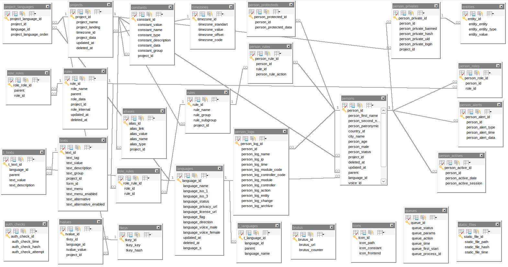

<small>Предыдущие статьи:

- ➡️ [Раздел 12. Модуль Free](/docs/12-module-free)
- ➡️ [Раздел 13. Модуль Geo](/docs/13-module-geo)
- ➡️ [Раздел 14. Создание модуля](/docs/14-module-custom)
</small>
# SLOT-H: Структура базы данных

Демо-версия включает таблицы, обеспечивающие полную функциональность системы.

---

## aliases

Таблица для хранения коротких ссылок. Позволяет создавать человеко-читаемые URL-адреса вместо стандартных `module/controller/action`. Каждая запись связывает короткий путь с полным внутренним адресом.

- `alias_id` - первичный ключ
- `alias_link` - полный внутренний путь (например, `Free/About/index`)
- `alias_value` - короткий путь (например, `about`)
- `alias_name` - название ссылки для отображения в админке
- `alias_type` - тип ссылки (видимая, скрытая)
- `project_id` - идентификатор проекта

---

## auth_checks

Таблица для отслеживания попыток авторизации. Используется для защиты от брутфорса - ограничивает количество неудачных попыток входа с одного клиента.

- `auth_check_id` - первичный ключ
- `auth_check_time` - время попытки
- `auth_check_hash` - хеш клиента (IP + User-Agent)
- `auth_check_attempt` - количество попыток

---

## brutus

Таблица для фиксации подозрительных запросов. Логирует попытки доступа к несуществующим страницам и файлам, помогает выявлять сканирование системы.

- `brutus_id` - первичный ключ
- `brutus_url` - запрошенный URL
- `brutus_counter` - количество обращений к этому URL

---

## constants

Таблица для хранения динамических констант. Позволяет изменять настройки системы через интерфейс администратора без редактирования файлов и перезагрузки сервера. Константы могут быть общими для всех проектов или привязанными к конкретному проекту.

- `constant_id` - первичный ключ
- `constant_value` - значение константы
- `constant_name` - имя константы (идентификатор)
- `constant_type` - тип (системная или пользовательская)
- `constant_description` - описание
- `constant_data` - дополнительные данные (JSON)
- `constant_group` - группа константы
- `project_id` - идентификатор проекта (NULL - для всех проектов)

---

## entities

Таблица для хранения связей между сущностями и их значениями. Используется для универсальных ссылок и поиска.

- `entity_id` - первичный ключ
- `entity_entity` - идентификатор сущности
- `entity_entity_type` - тип сущности
- `entity_value` - значение

---

## icons

Таблица для хранения SVG-иконок. Хранит пути к иконкам, доступным через систему.

- `icon_id` - первичный ключ
- `icon_path` - SVG-путь
- `icon_constant` - константа иконки
- `icon_frontend` - доступность на фронтенде

---

## languages

Таблица для хранения языков. Содержит информацию о поддерживаемых языках, их ISO-кодах, направлении письма (LTR/RTL) и голосовых настройках.

- `language_id` - первичный ключ
- `language_name` - название языка
- `language_iso_1` - двухбуквенный ISO-код
- `language_iso_3` - трёхбуквенный ISO-код
- `language_status` - статус (включён/отключён)
- `language_privacy_url` - URL политики конфиденциальности
- `language_license_url` - URL лицензии
- `language_flag` - флаг языка
- `language_direction` - направление письма (LTR/RTL)
- `language_voice_male` - мужской голос
- `language_voice_female` - женский голос
- `language_s` - суффикс языка
- `updated_at` - время обновления
- `deleted_at` - время удаления (soft delete)

---

## person_actives

Таблица для хранения информации об активных пользователях. Отслеживает, кто находится на сайте в данный момент, и используется для отображения онлайн-статуса.

- `person_active_id` - первичный ключ
- `person_id` - идентификатор пользователя
- `person_active_date` - время последней активности
- `person_active_session` - идентификатор сессии

---

## person_alerts

Таблица для хранения уведомлений пользователей. Используется для отправки системных сообщений и оповещений.

- `person_alert_id` - первичный ключ
- `person_id` - идентификатор пользователя
- `person_alert_type` - тип уведомления
- `person_alert_time` - время создания
- `person_alert_data` - данные уведомления (JSON)

---

## person_logs

Таблица для логирования действий пользователей. Фиксирует все действия: вход, просмотр страниц, изменения данных, создание и удаление записей. Используется для аудита и анализа активности.

- `person_log_id` - первичный ключ
- `person_id` - идентификатор пользователя
- `person_log_name` - имя пользователя
- `person_log_ip` - IP-адрес
- `person_log_time` - время действия
- `person_log_module_code` - код модуля
- `person_log_controller_code` - код контроллера
- `person_log_module` - название модуля
- `person_log_controller` - название контроллера
- `person_log_action` - название экшена
- `person_log_entity` - идентификатор сущности
- `person_log_change` - описание изменений
- `person_log_archive` - флаг архивации

---

## person_privates

Таблица для хранения аутентификационных данных пользователей. Содержит логины, хеши паролей и UID для сессий.

- `person_private_id` - первичный ключ
- `person_id` - идентификатор пользователя
- `person_private_banned` - статус бана
- `person_private_hash` - хеш пароля
- `person_private_uid` - уникальный идентификатор для сессии
- `person_private_login` - логин пользователя
- `project_id` - идентификатор проекта

---

## person_protecteds

Таблица для хранения дополнительных данных пользователей. Содержит настройки и предпочтения в формате JSON.

- `person_protected_id` - первичный ключ
- `person_id` - идентификатор пользователя
- `person_protected_data` - данные пользователя (JSON)

---

## person_roles

Таблица для связывания пользователей с ролями. Определяет, какие роли назначены каждому пользователю.

- `person_role_id` - первичный ключ
- `person_id` - идентификатор пользователя
- `role_id` - идентификатор роли

---

## person_rules

Таблица для индивидуальных прав пользователей. Основной пул прав пользователь получает из `role_rules` по своей роли из `person_roles`. Эта таблица позволяет кастомно назначить дополнительное право или отключить одно из базовых, выданных по роли.

- `person_rule_id` - первичный ключ
- `person_id` - идентификатор пользователя
- `rule_id` - идентификатор права
- `person_rule_action` - действие (добавить/отозвать)

---

## persons

Основная таблица пользователей. Хранит личные данные: имя, фамилию, отчество, возраст, пол, статус, языковые и временные настройки.

- `person_id` - первичный ключ
- `person_first_name` - имя
- `person_second_name` - фамилия
- `person_patronymic` - отчество
- `country_id` - идентификатор страны
- `city_name` - название города
- `person_age` - дата рождения
- `person_male` - пол
- `person_status` - статус пользователя
- `project_id` - идентификатор проекта
- `parent` - идентификатор родительского пользователя
- `language_id` - идентификатор языка
- `voice_id` - идентификатор голоса
- `person_notification` - настройки уведомлений
- `timezone_id` - идентификатор часового пояса
- `updated_at` - время обновления
- `deleted_at` - время удаления (soft delete)

---

## project_languages

Таблица для связывания проектов с языками. Определяет, какие языки доступны в каждом проекте и порядок их отображения.

- `project_language_id` - первичный ключ
- `project_id` - идентификатор проекта
- `language_id` - идентификатор языка
- `project_language_order` - порядок сортировки

---

## projects

Основная таблица проектов. Хранит информацию о каждом сайте: название, домен, временную зону и дополнительные данные.

- `project_id` - первичный ключ
- `project_name` - название проекта
- `project_landing` - домен проекта
- `timezone_id` - идентификатор часового пояса
- `project_data` - дополнительные данные (JSON)
- `updated_at` - время обновления
- `deleted_at` - время удаления (soft delete)

---

## queues

Таблица для хранения задач асинхронной очереди. Используется для фоновой обработки: отправка писем, обработка изображений, создание дампов.

- `queue_id` - первичный ключ
- `queue_status` - статус задачи
- `queue_params` - параметры задачи (JSON)
- `queue_action` - тип задачи
- `queue_time` - время выполнения
- `queue_first_start` - время первого запуска
- `queue_process_id` - идентификатор процесса

---

## role_roles

Таблица для построения иерархии ролей. Определяет, какая роль является родительской для другой.

- `role_role_id` - первичный ключ
- `parent` - идентификатор родительской роли
- `role_id` - идентификатор дочерней роли

---

## role_rules

Таблица для связывания ролей с правами. Определяет, какие права доступны для каждой роли.

- `role_rule_id` - первичный ключ
- `role_id` - идентификатор роли
- `rule_id` - идентификатор права

---

## roles

Таблица ролей. Хранит информацию о ролях пользователей и их иерархии.

- `role_id` - первичный ключ
- `role_name` - название роли
- `parent` - идентификатор родительской роли
- `role_data` - дополнительные данные (JSON)
- `project_id` - идентификатор проекта
- `role_internal` - признак внутренней роли
- `updated_at` - время обновления
- `deleted_at` - время удаления (soft delete)

---

## rules

Таблица прав. Хранит список доступных прав, сгруппированных по категориям.

- `rule_id` - первичный ключ
- `rule_name` - название права
- `rule_group` - группа прав
- `rule_subgroup` - подгруппа прав
- `project_id` - идентификатор проекта

---

## static_files

Таблица для хранения хешей статических файлов (CSS, JS). Используется для управления кешированием и автоматического обновления версий файлов.

- `static_file_id` - первичный ключ
- `static_file_path` - путь к файлу
- `static_file_hash` - хеш файла
- `static_file_time` - время последнего изменения

---

## t_languages

Таблица переводов для языков. Хранит локализованные названия языков.

- `t_language_id` - первичный ключ
- `language_id` - идентификатор языка
- `parent` - идентификатор родительской записи
- `language_name` - название языка на конкретном языке

---

## t_texts

Таблица переводов для текстов. Хранит локализованные версии текстовых блоков.

- `t_text_id` - первичный ключ
- `language_id` - идентификатор языка
- `parent` - идентификатор родительской записи
- `text_value` - переведённый текст
- `text_description` - описание перевода

---

## texts

Таблица для хранения статических текстов. Используется для управления контентом страниц через интерфейс администратора.

- `text_id` - первичный ключ
- `text_tag` - уникальный тег текста
- `text_value` - текст
- `text_description` - описание
- `text_group` - группа текста
- `project_id` - идентификатор проекта
- `form_id` - идентификатор формы
- `text_menu` - привязка к меню
- `text_menu_enabled` - показывать в меню
- `text_alternative` - альтернативный текст
- `text_alternative_enabled` - альтернатива включена

---

## timezones

Таблица часовых поясов. Содержит список доступных часовых поясов с их смещением относительно UTC.

- `timezone_id` - первичный ключ
- `timezone_standart` - стандартное название
- `timezone_value` - значение для отображения
- `timezone_offset` - смещение в часах
- `timezone_code` - код часового пояса

---

## tkeys

Таблица для хранения ключей переводов. Содержит уникальные ключи для строк, используемых в коде.

- `tkey_id` - первичный ключ
- `tkey_key` - исходный текст
- `tkey_hash` - хеш текста

---

## tvalues

Таблица для хранения значений переводов. Содержит переводы строк для каждого языка.

- `tvalue_id` - первичный ключ
- `tkey_id` - идентификатор ключа
- `language_id` - идентификатор языка
- `tvalue_value` - переведённое значение
- `project_id` - идентификатор проекта

---

## Диаграмма связей

Ниже представлена диаграмма связей между таблицами демо-версии.

---

## Что дальше?

- ➡️ [Раздел 16. Принципы ORM](/docs/16-orm-principles)
- ➡️ [Раздел 17. Методы работы](/docs/17-orm-methods)
- ➡️ [Раздел 18. Использование JOIN](/docs/18-join)
